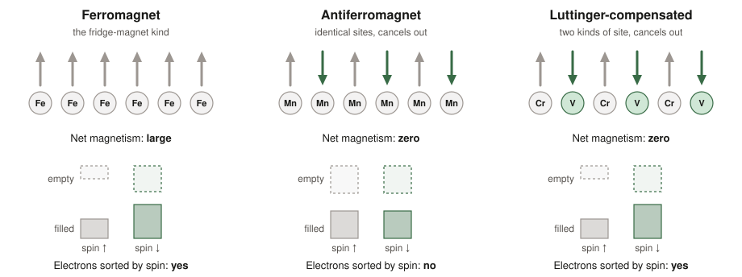
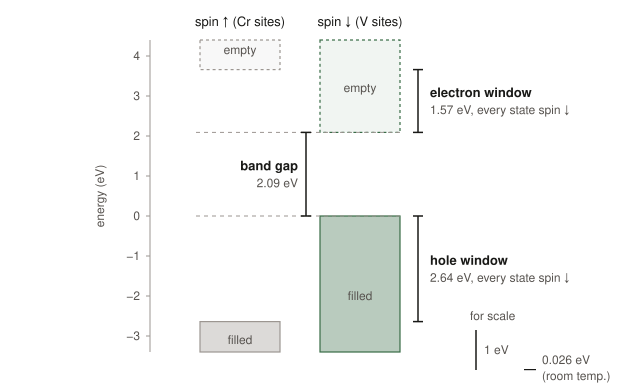
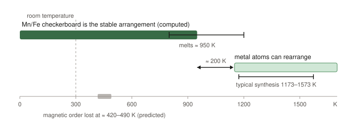

# Two magnets that add up to zero (and one has been on the shelf since 1999)

*October 2026. Everything below was computed by Claude Opus 5.5 agents running quantum-mechanical simulations on cloud computers. The inputs, raw outputs and scripts behind the numbers are in a ledger where anyone can check or re-run them.*

---

Most of us know two kinds of magnet, even if we don't know their names.

The fridge kind is a **ferromagnet**: trillions of tiny atomic magnets all point the same way, so their pull adds up to something you can feel. The second kind, an **antiferromagnet**, is magnetic on the inside: neighbouring atomic magnets point in opposite directions and cancel exactly. You can't stick it to anything.

For years, people building next-generation computer memory have wanted something in between. Over the past few days, a team of AI agents and I went looking for materials that might be it. We ended up with two candidates:

- one we designed from scratch, which our own calculations suggest may be hard to make;
- one first made in a lab in 1999 that turns out to have this property, something we found no earlier paper pointing out.

This post explains what we found, how sure we are, and where all the raw data is.

## A 90-second magnet primer

Electrons have a property called *spin*, which makes each one a tiny magnet that points "up" or "down". This matters for technology because spin can carry information; that is the idea behind **spintronics**, which already gives us the read heads in hard drives and a kind of memory chip called MRAM.

- **Ferromagnets** are great for spintronics because the electrons that carry current are *sorted by spin*: at the energies that matter, there are more up-electrons than down-electrons, or only up-electrons. But ferromagnets have stray magnetic fields that disturb their neighbours, which limits how tightly you can pack them. They are also comparatively slow to switch.
- **Antiferromagnets** have no stray field and can switch roughly a thousand times faster. But in an ordinary antiferromagnet the electrons are *not* sorted by spin, because every up-site has an identical down-site. That makes them hard to use for spintronics.

There is a third option that physicists have only recently named. Imagine an antiferromagnet in which the up-pointing atoms and the down-pointing atoms are **not equivalent** (for example two different elements, or the same element in two different kinds of site), but each carries *exactly the same* amount of magnetism. The totals still cancel, so ideally there is no stray field. But because the two kinds of atom are not equivalent, the electrons can tell them apart, and they end up **sorted by spin, as in a ferromagnet**.

These are called **Luttinger-compensated magnets**. The name refers to a theorem (Luttinger's) which guarantees that, in an insulating material of this kind, the cancellation is *exact*: each spin direction holds a whole number of electrons, so the net spin comes out at exactly zero, not merely approximately zero. (Strictly, that holds for a perfect crystal near absolute zero. Smaller effects such as spin–orbit coupling, and heat, can leave a slight imbalance.) The name comes from a 2022 editorial by the physicist Igor Mazin, and very few real examples are known. The only one confirmed by neutron experiments to be an insulator orders at −225 °C.

The wish list for a useful one is short to write down and hard to satisfy:

1. **Zero net spin**, fixed by the chemistry rather than by luck.
2. **Stays magnetic above room temperature.**
3. **A semiconductor**: it has a band gap, like silicon, so you can control how many charge carriers it has.
4. **The carriers are spin-sorted** at both edges of the band gap, over an energy range that is large compared with the thermal jiggling at room temperature (about 0.026 eV).

We call that energy range the **spin window**: the slice of energy at the edge of the gap where every available electron state has the same spin. A window of 1 eV is about 40 times the room-temperature jiggle, so in a perfect crystal the carriers would stay spin-sorted.

## How the search worked (and who did it)

I set up several Claude agents to run in parallel, each with a different lane of a broader search for unusual magnets. This post comes from the lane that hunted for Luttinger-compensated semiconductors.

The agents used **density functional theory (DFT)**, the standard way to compute how electrons arrange themselves in a crystal. They ran it with Quantum ESPRESSO, a free and widely used program, on cloud computers. The lane submitted about 750 computing jobs over three days, using two levels of theory:

- **PBE+U**: a fast approximation with a tunable parameter "U". The agents always checked several values of U.
- **HSE06**: a slower, usually more accurate method, used as the tie-breaker.

The agents were set up to argue with themselves. Before running a decisive calculation, they wrote down what result would kill the idea. Separate "referee" agents then tried to tear each claim apart, and several claims were retracted along the way. That record of corrections is part of the ledger.

## Candidate 1: YBaMnFeO₅, a blueprint that may be hard to build

**The idea.** Take a well-known family of layered oxide crystals. Put manganese (Mn) and iron (Fe) on the magnetic sites in a perfect 3D checkerboard, so that every Mn is surrounded by Fe and vice versa. In this compound Mn²⁺ and Fe³⁺ both have five unpaired electrons, so their magnets are the same size, and the checkerboard makes them point in opposite directions. Yttrium, barium and oxygen fill in the rest. Every element is cheap and earth-abundant.

**On paper, it is close to ideal.** Our calculations predict:

- zero net spin in the perfect crystal;
- a band gap of about **2.35 eV**;
- both edges of the gap carry the *same* spin, with windows of **1.0 eV and 1.4 eV** (40–55 times the room-temperature jiggle);
- it stays magnetic up to roughly **420 K (about 145 °C)** in the raw simulation, or about **490 K** after calibrating against a known relative;
- it sits close to, but not on, the edge of thermodynamic stability: about 14 meV per atom above the most stable mix of competing compounds that were computed, which is typical of compounds that have been made. (An earlier count, before every competing compound had finished, gave 2.6 meV per atom.)

**The catch is the checkerboard.** Mn and Fe sit next to each other in the periodic table, are nearly the same size, and differ by one unit of charge. That is not much of a reason for them to keep to their own squares.

When the agents simulated how the atoms arrange themselves at different temperatures, the checkerboard "melted" into a random mix at around **950 K (≈ 680 °C)**. To make this kind of oxide you heat it to roughly 900–1,300 °C, and at lower temperatures the atoms are effectively frozen in place. So by the time it is cool enough for the checkerboard to be favoured, the atoms may no longer be able to move into it, and standard synthesis would likely give a scrambled crystal.

*The checkerboard is the stable arrangement only below about 950 K (whisker: 800–1200 K uncertainty), but the metal atoms only rearrange quickly above roughly 1150 K (an estimate from a related compound), and syntheses run at 1173–1573 K. Ledger Y25–Y27.*

This isn't just theory: every chemically similar compound whose atomic arrangement has been checked came out scrambled. That includes versions with gadolinium or neodymium in place of yttrium, and one with cobalt in place of iron.

Scrambling ruins the effect. In the simulation, swapping a single neighbouring Mn/Fe pair (two of the 16 magnetic sites in the model) pushed states of the opposite spin into the gap and shrank the band gap from about 1.3 eV to almost nothing (0.01 eV).

**Verdict.** It is a beautiful blueprint and a useful lesson. The agents' own review downgraded it to a design study, because there is no known way yet to make the ordered crystal. The lesson is that the difference between the two magnetic sublattices has to be *enforced by strong chemistry*, not left to delicate atomic ordering. That lesson led directly to the second candidate.

## Candidate 2: KV[Cr(CN)₆], hiding in plain sight since 1999

**What it is.** KV[Cr(CN)₆] belongs to the same family as **Prussian blue**, the 300-year-old pigment. Picture a cubic scaffold of cyanide groups (one carbon and one nitrogen atom stuck together):

- chromium (Cr) atoms grab the **carbon** ends;
- vanadium (V) atoms grab the **nitrogen** ends;
- potassium ions sit in the holes.

In 1999, chemists Stephen Holmes and Gregory Girolami made it and found that their sample stays magnetic up to **376 K (103 °C)** (365 K after it had been heated), unusually high for a magnet assembled from molecular building blocks. They designed it so that the vanadium and chromium magnets, three unpaired electrons each, would cancel. They expected a net magnetisation of zero and measured almost zero: about 2 % of what you'd get if all the spins lined up. (Small leftovers like this are common in real samples, where a few atoms are missing or in a different charge state.) Nobody has measured its band gap or spin sorting.

**What we added.** The agents computed its electronic structure and found that, in an ideal crystal, it is a Luttinger-compensated magnet with the spin-sorted electronic structure described above:

- **zero net spin** in the perfect crystal, with a symmetry analysis that classifies it as this type of magnet;
- a **band gap of about 2.1 eV** (HSE06);
- **both band edges carry the same spin**, with spin windows of **2.6 eV** for holes and **1.6 eV** for electrons: 60 to 100 times the room-temperature jiggle;
- the cyanide bridge **fixes which metal sits where**: Cr strongly prefers carbon and V prefers nitrogen. This is exactly the chemical enforcement that YBaMnFeO₅ lacked.

V and Cr are different elements, and that difference is what produces the large windows. When the agents ran the same structure with chromium on *both* sites, Cr[Cr(CN)₆], the windows shrank to 0.1–0.4 eV and the two edges took opposite spins.

Its zero net magnetism is not new. Holmes and Girolami designed it that way, and two 2008 calculations found it to be an insulator with zero net moment. One of them, by Middlemiss, Lawton and Wilson, used hybrid functionals and plotted the electron states spin by spin: both band edges in their plot carry the same spin, with windows of roughly 3 eV and 1.5 eV. Their paper was about magnetic coupling under pressure and never remarked on this. What a literature search (October 2026) did not find is any work pointing out the spin sorting, putting numbers on it or testing how robust it is, or describing any Prussian-blue-type compound as a Luttinger-compensated magnet. The closest earlier work is a 2024 study of Cr[Cr(CN)₆], which noticed unequal spin-up and spin-down densities but did not take it further.

It also fills a gap others have pointed out. A 2025 paper that predicted two cyanide Luttinger-compensated semiconductors, Mn(CN)₂ and Co(CN)₂, found that they lose their magnetic order at 210 K and 75 K, and named room-temperature order as the open goal. KV[Cr(CN)₆] has already been made, and its 1999 sample stayed ordered up to 376 K.

**Limits of the result:**

1. **The calculations are for a perfect crystal.** The real 1999 material is a powder with water molecules in its holes, and there is a single published report of it.
2. **Water: the two methods disagree.** With water added to the model:
   - the more accurate method (HSE06) says the effect survives, with windows of about 2.3 and 1.4 eV;
   - the faster method (PBE+U) says the hole window shrinks by more than half.
   
   HSE06 is the more reliable of the two here, because PBE+U is known to put water's energy levels in the wrong place. (The agents' HSE06 water calculation had stopped before converging; it has since been run to convergence, which moved the hole window from 2.43 to 2.31 eV.)
3. **Missing building blocks.** Real samples of these compounds often lack some of their [Cr(CN)₆] units, and each missing unit adds magnetism, so "exactly zero" depends on getting the composition right. A water-filled vacancy kept both edges spin-sorted in HSE06 (windows 2.8 and 0.7 eV); PBE+U again disagreed about the electron edge.
4. **"Semiconductor" is on paper.** Nobody has measured this compound's band gap, conductivity or spin polarisation. Its electrons move in narrow energy bands, so carriers will be sluggish: think of a material that holds spin-sorted charges well rather than a fast transistor material.
5. **At room temperature it is close to its 376 K limit**, so its magnetic order is only about 60 % complete, which would dilute the effect.
6. **The general physics is known.** It has long been understood that this kind of magnet has spin-split electrons. What is new is pointing at this specific, real, above-room-temperature compound and putting numbers on it.

Here is how the two methods compare in each situation (spin windows in eV; ledger IDs in brackets):

| Situation | Hole window: HSE06 | Hole window: PBE+U | Electron window: HSE06 | Electron window: PBE+U |
|---|---|---|---|---|
| Ideal crystal | 2.64 [K16] | 2.02 [K07] | 1.57 [K17] | 1.15 [K08] |
| With water (·2H₂O) | 2.31 [K19b] | 0.93 [K21] | 1.40 [K20b] | 0.92 |
| Water-filled vacancy (in-cell) | 2.80 [K24] | 2.04 | 0.74 [K23] | 0.47 (0.07 aligned to the perfect crystal) |

## Scorecard

| | YBaMnFeO₅ | KV[Cr(CN)₆] |
|---|---|---|
| Origin | designed in this project | made by Holmes & Girolami, 1999 |
| Net spin (ideal crystal, 0 K) | zero | zero |
| Band gap (HSE06) | 2.35 eV | 2.09 eV |
| Spin windows, holes / electrons (HSE06) | 1.0 / 1.4 eV | 2.6 / 1.6 eV |
| Magnetic up to | ≈ 420 K raw, ≈ 490 K calibrated (predicted) | **376 K (measured on the hydrated powder)** |
| Can it be made? | may be hard: the atoms tend to scramble the checkerboard | yes, once, as a hydrated powder |
| Biggest open question | is there any route to the ordered crystal? | does the spin sorting survive in real, wet, imperfect samples? |
| Ever measured spin-sorted? | no | no |

## How to check every number

Everything is packaged as a **computational ledger**: [github.com/spicylemonade/compensated-magnet-ledger](https://github.com/spicylemonade/compensated-magnet-ledger). It contains:

- the exact input files for nearly 900 calculations, with their raw, unedited outputs (including every run behind the atomic-ordering and stability results);
- the relaxed crystal structures;
- the analysis scripts;
- a list of every claim, which links each number to the files it came from.

It also records the mistakes the agents caught and corrected along the way, and the caveats they flagged.

There are three levels of checking:

1. **Check the arithmetic, in a few seconds.** `python tools/verify.py` recomputes 52 numbers directly from the raw outputs and checks 6 more against the included scripts' results and recorded analysis files. Today it reports 58 pass and 0 fail.
2. **Re-run the models, in minutes on a laptop.** Scripts redo the magnetic-ordering-temperature simulation (the re-run gives 414 K against the recorded 417 K) and the checkerboard-melting simulation that rules out YBaMnFeO₅ (it reproduces the recorded 915–965 K exactly).
3. **Re-run the quantum calculations from scratch.** The repository includes the exact pseudopotential files' checksums and scripts to download and run everything. We did this ourselves in a fresh cloud machine for a representative set of calculations; see `reproduce/RESULTS.md`.

If you find an error, open an issue on the repository.

## What would settle it

The most decisive test is for KV[Cr(CN)₆], because it already exists:

1. **Remake it** and measure its composition and magnetism carefully. This is the cheapest step and confirms the starting point.
2. **Element-specific X-ray magnetic measurements** (XMCD at the V and Cr edges) and magneto-optics on samples with near-zero magnetisation. These would show the two sublattices cancelling while the electronic signal stays.
3. **Spin-resolved photoemission**, which knocks electrons out with light and measures their spin. The prediction is that the top ~2 eV of filled states are essentially all one spin, flipping when the magnetic order is reversed.

If someone with a glovebox and a synchrotron proposal is reading this, the ledger has the numbers to compare against.

## What I took away

AI agents are good at breadth and at being systematically sceptical when they are set up to be. In three days they ran hundreds of calculations and checked the literature. They also set aside their own favourite idea, YBaMnFeO₅, and only then found the better candidate hiding in a 1999 paper.

The next step belongs to the lab. Nothing here has been measured yet, and the open question, whether real KV[Cr(CN)₆] keeps its spin-sorted edges, needs an experiment.

The ledger gives anyone running those experiments the exact numbers to test against.

---

**Fine print.**

- Computations: Quantum ESPRESSO 7.5 with PseudoDojo pseudopotentials on Modal cloud CPUs, set up, run and analysed by Claude agents (Anthropic), October 2026.
- The experimental facts about KV[Cr(CN)₆] come from S. M. Holmes and G. S. Girolami, *J. Am. Chem. Soc.* **121**, 5593 (1999).
- The term "Luttinger-compensated" comes from I. Mazin's 2022 *Physical Review X* editorial.
- Earlier calculations on KV[Cr(CN)₆]: L. Kabalan et al., *Chem. Phys.* **352**, 85 (2008); D. S. Middlemiss, L. M. Lawton and C. C. Wilson, *J. Phys.: Condens. Matter* **20**, 335231 (2008). The closest prior computational work on spin-split bands in this family is Schart et al., *Inorg. Chem.* **63**, 22856 (2024).
- The 2025 cyanide Luttinger-compensated semiconductors: P.-J. Guo et al., arXiv:2502.18136.
- All numbers, files and caveats: see the [ledger](LEDGER.md).
